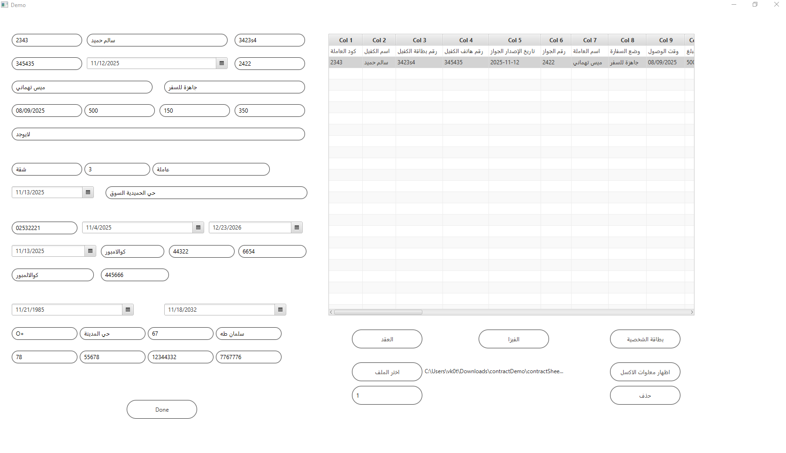

# ContractApp – JavaFX Automated Document Generator

ContractApp is a standalone **JavaFX** desktop application that collects sponsor and worker information, then automatically generates **three Word documents** based on the entered data:

1. **Visa Information Document**
2. **National ID Information Document**
3. **Contract Information Document**

The system loads predefined Word templates, replaces bookmark fields using **Spire.Doc for Java**, and exports final `.doc` files ready for printing.

---

## 🔹 Key Features

- Full JavaFX UI (no FXML files required).
- Collects all necessary contract/visa/ID data.
- Generates 3 separate Word documents from one form.
- Uses Spire.Doc to replace bookmarks inside `.doc` templates.
- Relative paths → works on any machine without editing code.
- Runs on Java 8–17.
- Supports JavaFX SDK for JDK 11+.
- Simple workflow: Fill → Done → Documents generated.

---

## 📸 Application Screenshot



---

## 📂 Project Structure

```
ContractApp/
│
├── src/
│   └── sample/
│       ├── ContractGUI.java        # Builds UI and handles user actions
│       ├── Contract.java           # Logic to generate 3 Word documents
│       │
│       ├── Contracts/
│       │   ├── contract_template.doc
│       │   ├── visa_template.doc
│       │   ├── id_template.doc
│       │   ├── contract_output.doc
│       │   ├── visa_output.doc
│       │   └── id_output.doc
│       │
│       ├── sample.fxml (unused)
│       └── Controller.java (unused)
│
├── lib/                            # MUST contain all external JARs
│   ├── spire.doc.jar
│   ├── javafx-controls.jar
│   ├── javafx-graphics.jar
│   ├── javafx-base.jar
│   └── ...
│
├── out/                            # Compiler output
│
└── README.md
```

---

## 🔧 Requirements

### ✔ JDK 8–17  
- JDK 8 → JavaFX included  
- JDK 11+ → download JavaFX SDK manually  

### ✔ Spire.Doc for Java  
Place all `.jar` files into `lib/`  
(Include dependencies)

### ✔ JavaFX SDK (JDK 11+)  
Copy all javafx-*.jar files into `lib/`

---

## 🛠 Preparing the Project

### 1️⃣ Place all JAR libraries inside:

```
lib/
```

### 2️⃣ Use **relative paths** inside Contract.java:

```java
Document doc = new Document("src/sample/Contracts/contract_template.doc");
doc.saveToFile("src/sample/Contracts/contract_output.doc", FileFormat.Doc);
```

Repeat similarly for:

- visa_template → visa_output  
- id_template → id_output  

### 3️⃣ Ensure DatePicker fields are filled before clicking Done  
(Spire.Doc throws errors for null bookmarks.)

---

## ▶️ Build & Run (CMD / PowerShell)

Navigate to:

```
D:\ContractApp
```

### 🔨 Compile:

```
javac -cp "lib/*;src" --module-path lib --add-modules javafx.controls,javafx.graphics ^
      -d out src/sample/*.java
```

### ▶️ Run:

```
java -cp "lib/*;out" --module-path lib --add-modules javafx.controls,javafx.graphics sample.ContractGUI
```

### ▶️ Run directly from src/:

```
java -cp "lib/*;src" sample.ContractGUI
```

### 💡 For JDK 8  
Remove module path switches.

---

## 🧪 Testing the System

1. Launch the application.  
2. Fill out all form fields.  
3. Click **Done**.  
4. Three documents are generated:

```
contract_output.doc
visa_output.doc
id_output.doc
```

inside:

```
src/sample/Contracts/
```

5. Open each file to verify correct bookmark replacement.

---

## 🎯 Recommended Improvements

- Add form validation (avoid null fields).
- Add “success” and “error” popups.
- Support exporting PDF (Spire.Doc supports it).
- Move templates/configuration to external JSON file.
- Consider migrating UI to FXML for cleaner structure.

---

## 👨‍💻 Developer
**Ramazan Dev**  
JavaFX & Desktop Applications Developer
